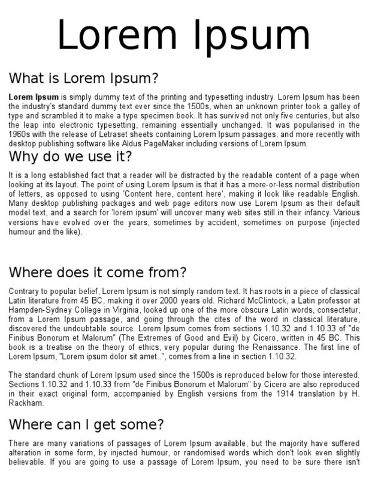
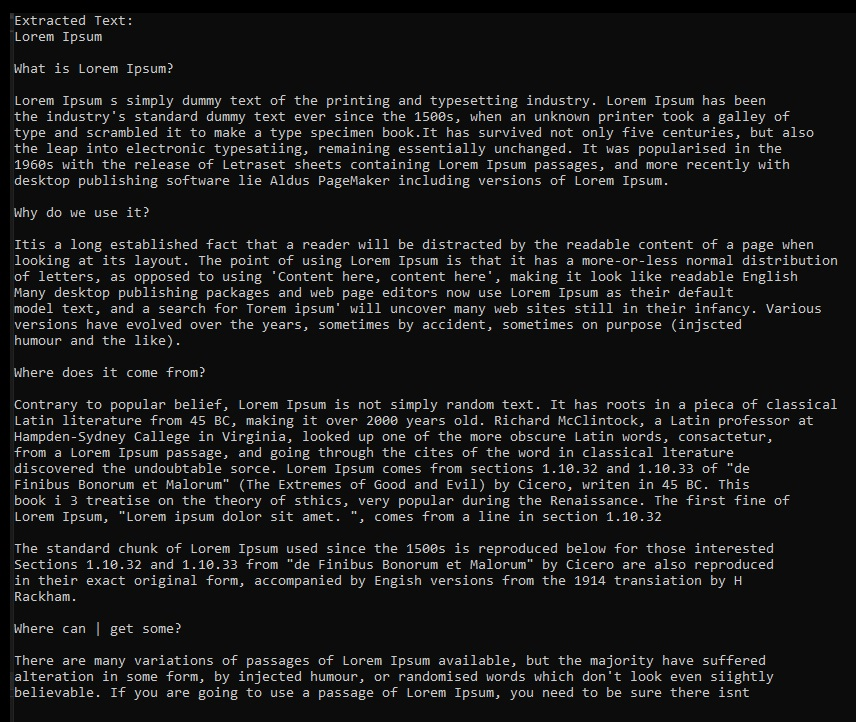

# ImageVocalizer

This is a simple demo that shows how to extract text from images using the Tesseract OCR engine in a C# .NET Core 8 console application. The project reads text from an image, outputs the recognized text in the console, and reads the extracted text aloud using a speech synthesizer.

## Project Overview

The application reads an image (`que-es-lorem-ipsum.jpg`) from the project folder and processes it using Tesseract to extract any readable text. The extracted text is then displayed in the console and spoken aloud using `System.Speech.Synthesis`.

### Technologies Used

- **C#**: The primary language for the application.
- **.NET Core 8**: The framework used to build the console application.
- **Tesseract OCR**: A powerful Optical Character Recognition (OCR) engine used to read text from images.
- **System.Speech.Synthesis**: A speech synthesis library used to convert the extracted text into speech and read it aloud.

## Demo

### Input Image

This is the original image that the application processes to extract text:



### Console Output and Speech

This is a screenshot of the console output after the application successfully extracts text from the image. In addition, the text is read aloud by the application:



## How to Run the Project

### Prerequisites

- **.NET Core 8 SDK** installed on your system.
- **Tesseract OCR**: Download and install the [Tesseract OCR engine](https://github.com/tesseract-ocr/tesseract) and ensure that you have the necessary language data files (e.g., `eng.traineddata`) in the `tessdata` folder.
- **System.Speech.Synthesis**: This is included with .NET on Windows.

### Setup Instructions

1. Clone the repository:
    ```bash
    git clone https://github.com/Gitrep77/ImageVocalizer.git
    ```

2. Navigate to the project directory:
    ```bash
    cd ImageVocalizer/ImageVocalizer
    ```

3. Ensure the path to Tesseract’s `tessdata` folder is set correctly in the code:
    ```csharp
    const string tessdataPath = @"C:\programs\TesseractOcr\tessdata";
    ```

4. Ensure the image `que-es-lorem-ipsum.jpg` is placed in the `Images` folder or update the path in the code to match the location of your image:
    ```csharp
    string imagePath = Path.Combine(baseDirectory, "..", "..", "..", "Images", "que-es-lorem-ipsum.jpg");
    ```

5. Build and run the application:
    ```bash
    dotnet run
    ```

The application will output the recognized text from the image into the console and read it aloud using the system's speech synthesizer.

## License

This project is licensed under the MIT License. See the [LICENSE](LICENSE) file for details.

## Contributing

Contributions are welcome! Feel free to open issues or submit pull requests for improvements.

## Support

If you encounter any issues or have questions, feel free to open an issue in the repository or contact me on [GitHub](https://github.com/Gitrep77).

---

Thank you for checking out this demo project! 😊
